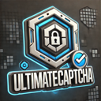

# UltimateCaptcha Plugin for PocketMine-MP



## Introduction
UltimateCaptcha is a highly secure and customizable captcha plugin designed for PocketMine-MP 5.x. This plugin helps protect your server by requiring players to complete a captcha before they can interact with the world. It ensures that only legitimate players gain access while preventing automated bots from causing trouble.

## Features
- **Customizable Captcha**: Configure captcha type, text length, and case sensitivity.
- **UI Integration**: Uses Vecnavium FormsUI for a sleek and intuitive user interface.
- **Player Verification Persistence**: Once a player successfully completes the captcha, they won’t need to do it again unless specified in the config.
- **Discord Notifications**: Sends alerts to a Discord webhook when a player fails the captcha multiple times.
- **Fully Configurable**: All settings, including messages, colors, and webhook URLs, are customizable via `config.yml`.

## Requirements
- PocketMine-MP 5.x
- Vecnavium FormsUI

## Installation
1. Download the latest release of UltimateCaptcha from [GitHub Releases](#).
2. Place the `UltimateCaptcha` folder in the `plugins` directory of your PocketMine-MP server.
3. Ensure that Vecnavium FormsUI is installed and loaded.
4. Start your server and modify the `config.yml` file located in `plugins/UltimateCaptcha/resources/` to suit your needs.

## Configuration
Here is an example `config.yml` file:

```yaml
Captcha:
  ShowOnEveryJoin: false
  MaxAttempts: 3
  NotifyOnSuspicious: true
  CaptchaType: "TEXT"
  RandomTextLength: 6
  UseCaseSensitive: true
  ResendFormDelay: 0
  BlockMovement: true
  BlockInteract: true
  BlockCommands: true
  BlockChat: true

Messages:
  Title: "§l§bUltimateCaptcha"
  Description: "Please complete this captcha to unlock!"
  WrongAnswer: "§cIncorrect captcha. Try again!"
  CorrectAnswer: "§aYou have passed the captcha!"
  SuspiciousAlert: "§cYou have exceeded the maximum attempts!"
  BlockedInteract: "§cYou must complete the captcha first!"

Discord:
  WebhookURL: "https://discord.com/api/webhooks/XXXXX/XXXXX"
  SuspiciousMessage: "Player {player} might be a bot! Too many captcha failures."
```

## Permissions
| Permission                          | Description                                   | Default |
|------------------------------------|-----------------------------------------------|---------|
| `ultimatecaptcha.command.captcha`  | Allows players to use the `/captcha` command  | false   |
| `ultimatecaptcha.bypass`           | Allows players to bypass the captcha          | op      |

## Commands
- **`/captcha`**: Forces the captcha form to appear again for the player using the command.

## How It Works
1. When a player joins the server, they will be prompted with a captcha if:
   - They haven’t completed the captcha before.
   - `ShowOnEveryJoin` is set to `true` in `config.yml`.
2. Players must correctly type the random text displayed in the captcha form.
3. If a player fails the captcha multiple times (based on `MaxAttempts`), a Discord alert will be sent if `NotifyOnSuspicious` is enabled.
4. Once a player successfully completes the captcha, they are added to `verifiedPlayers.yml`, ensuring they won’t see the captcha again unless `ShowOnEveryJoin` is enabled.

## Contributing
Contributions are welcome! Feel free to fork this repository and submit a pull request with your changes.

## License
This project is licensed under the MIT License. See the [LICENSE](LICENSE) file for more details.

## Issues
If you encounter any issues or have feature requests, please open an issue in the [GitHub Issues](#) section.

## Contact
For further inquiries or support, please contact the plugin developer via GitHub.

---

Thank you for using UltimateCaptcha! Protect your server and enjoy a bot-free environment!

